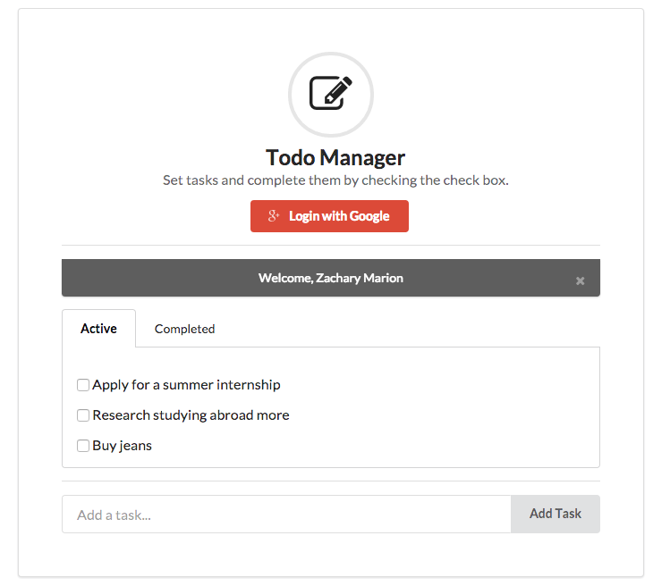

# Auth with AngularFire

### Instructions

Install dependences with `npm install`. Specify "semantic" as a folder in the root directory when asked. Then `cd semantic` and run `gulp build`. Fire up a server and you've got yourself a todo app.

### About / Using

This single page app shows the basics of auth with AngularFire, most of which can be found in `scripts/controllers.js`. In the process it also shows how to use Firebase and Angular together to show user specific data (because what's the point of OAuth without doing anything with it?). As an added bonus it incorporates [SemanticUI](http://semantic-ui.com/), which is a welcome change from Bootstrap IMO. Enjoy!
